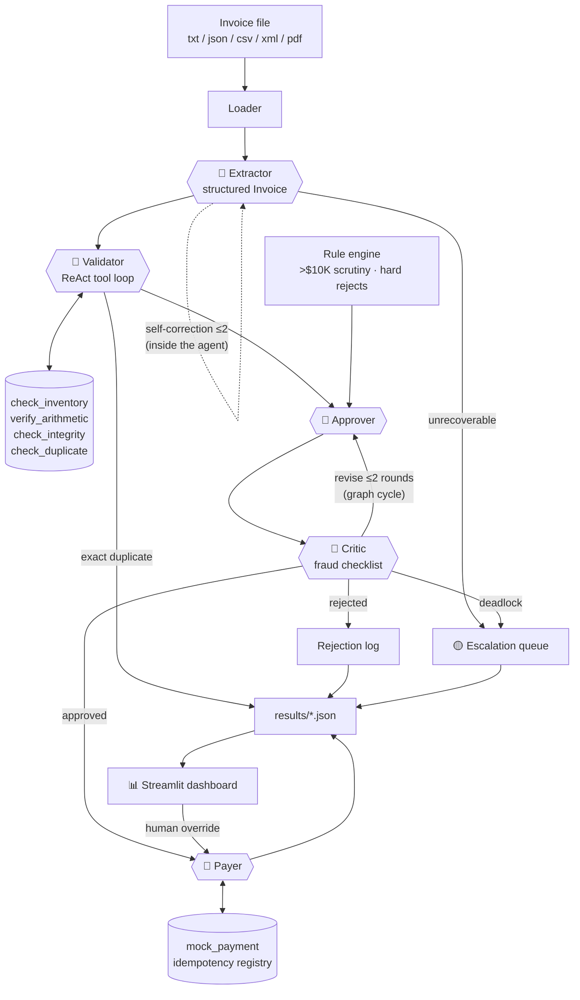
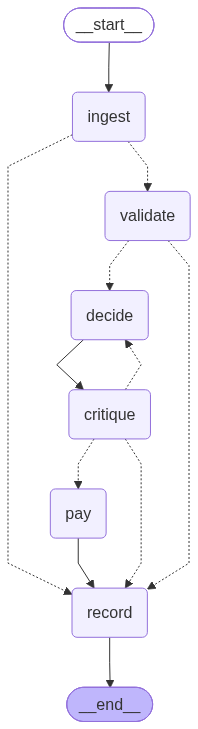

# InvoiceFlow — Multi-Agent Invoice Processing

A working prototype that automates Acme Corp's end-to-end invoice workflow —
**ingestion → validation → approval → payment** — replacing a manual process
with a 30% error rate and 5-day turnaround. Five LLM agents, orchestrated with
**LangGraph** (LangChain's multi-agent layer) and reasoning with **xAI Grok**,
process messy real-world invoices: typos, OCR artifacts, fraud attempts,
duplicate submissions, and data that simply doesn't add up.

*(Original case brief: [docs/CASE.md](docs/CASE.md).)*

## Quickstart

```bash
uv sync                                                    # install (Python 3.12)
cp .env.example .env                                       # put your XAI_API_KEY in it
uv run python main.py --init-db                            # create + seed inventory.db
uv run python main.py --invoice_path=data/invoices/invoice_1001.txt
uv run python main.py --all                                # batch: all 20 sample files
uv run streamlit run ui/app.py                             # review dashboard
```

Grok is the pipeline's only brain — there is deliberately no rule-based
fallback parser. "Offline" in the brief means the *surrounding* systems
(inventory DB, banking API) are simulated locally, not that the LLM is
optional. The test suite, however, runs entirely without a key (see Testing).

## The multi-agent system

Five separately-prompted agents share a LangGraph `StateGraph`. Control is
routed by conditional edges over each agent's **structured output** — agents
never call each other directly, so every hop is inspectable and testable.



That diagram is the conceptual flow, not the graph: the tool cylinders, the rule
engine and the dashboard are code called *inside* nodes, not nodes themselves.

The **dotted self-loop on the Extractor** marks the one distinction worth
knowing before you go reading: it is a `for` loop inside
[`run_extractor`](src/invoiceflow/agents.py) that feeds each failure back into
the next prompt — *not* a cycle in the graph, so it appears nowhere in graph.py.
The Approver ↔ Critic revision arrow is the opposite: a real conditional edge
routing `critique` back to `approve`. Both are called self-correction loops
below; only one is a LangGraph edge.

The graph LangGraph *actually* compiles is exported on every `build_graph()`
call, so the picture can never drift from the code (mermaid source alongside it
in [docs/graph.mmd](docs/graph.mmd)) — note it has no self-edge on `ingest`,
and the approve/critique cycle is right there:



| Agent | Role | Agentic pattern |
|---|---|---|
| **Extractor** | Messy text → structured `Invoice` (canonical item names, OCR fixes) | Self-correction loop #1, **in-agent**: schema/sanity errors fed back into the next prompt, ≤2 retries |
| **Validator** | Interrogates the invoice against inventory & records | ReAct tool-calling loop over 4 deterministic tools |
| **Approver** | Drafts approve / reject / needs-review with business rationale | Proposer in a reflection pair |
| **Critic** | Adversarial audit against a fraud & scrutiny checklist | Self-correction loop #2, **a graph cycle**: can force revisions or escalate to a human |
| **Payer** | Executes the mock payment or logs the rejection | Guarded tool execution (never pays twice) |

### Design decisions

- **The LLM is the only parser.** All document understanding — typos, OCR
  artifacts, five file formats, weird layouts — is Grok's job via structured
  output. A regex/heuristic fallback would be brittle in exactly the ways
  this exercise is about, so none exists.
- **Two self-correction loops, two mechanisms — deliberately.** The rule is
  whether the loop's intermediate state belongs in the audit trail. Each
  Approver/Critic round is evidence a human reviewer may need, so it is a graph
  cycle and every round is persisted in `critique_rounds`. A malformed first
  extraction draft is a mechanical detail, so it stays an in-agent loop and only
  the *count* surfaces, as `extraction_retries`. Promoting it to a graph cycle
  would push `raw_text`, the catalog and per-attempt feedback into the
  pipeline-wide state and into every run's JSON, for no reviewer's benefit.
- **Deterministic where the answer is checkable.** Stock aggregation,
  arithmetic verification, duplicate detection, and hard approval rules are
  plain, unit-tested Python exposed to the agents as tools. The LLM decides
  and interprets; the tools do the math.
- **Hard rules outrank both agents.** Even if the Approver *and* Critic wave
  through an invoice with critical failures, the graph overrides them
  (proven by a `RogueApprover` test).
- **Escalation over false confidence.** Ambiguous cases (unknown items,
  foreign currency, revised invoices) become `needs_review` and land in the
  dashboard's escalation queue with one-click human resolution — not a forced
  guess.
- **Idempotency built in.** A processed-invoice registry fingerprints each
  invoice by canonical content, so the same invoice arriving twice — even as
  TXT once and PDF once — is caught as a duplicate and never double-paid.
- **Testable without pretending.** Tests inject a fake `BaseChatModel` that
  replays *recorded ground-truth extractions* (fixtures, not a parser), so
  the full graph — tool loops, reflection, routing, registry, payment — runs
  offline, while extraction correctness itself is asserted against live Grok.

## What it catches (the 16 sample invoices)

| Invoice | Landmine | Outcome |
|---|---|---|
| 1001, 1004, 1006, 1015 | clean | ✅ paid |
| 1002 | typos everywhere; 20× GadgetX vs 5 in stock; due = issue date | ⛔ rejected |
| 1003 | zero-stock item, $100K, "due yesterday", urgency pressure | ⛔ rejected |
| 1004-revised | same invoice number, changed content after payment | 🟡 review (paid record preserved) |
| 1005 | aggregate GadgetX order exceeds stock | ⛔ rejected |
| 1007 | stock exceeded on 2 items **and** stated total is $110 short | ⛔ rejected |
| 1008 | items that don't exist; total suspiciously just under $10K | 🟡 review |
| 1009 | no vendor, negative quantity, negative total | ⛔ rejected |
| 1010 | duplicate item lines, tax + shipping arithmetic | ✅ paid |
| 1011/1012 PDFs | PDF extraction; OCR artifacts (`$3,500.O0`, `2O26`) | ✅ paid; resubmitted format = 🔁 duplicate |
| 1013 | 8 line items; quantities only exceed stock *in aggregate* | ⛔ rejected |
| 1014 | XML, EUR currency | 🟡 review |
| 1016 | item missing from inventory | 🟡 review |

## Testing & quality

```bash
uv run pytest                      # 61 offline tests, ~3s, no API key needed
uv run pytest --cov=invoiceflow    # with coverage
uv run pytest -m live              # against real Grok (needs XAI_API_KEY)
uv run ruff check && uv run ruff format --check
uv run pyright                     # static types: clean, 0 errors
```

Type checking is configured in `pyproject.toml` and passes clean, with one rule
switched off deliberately: LangGraph nodes return *partial* state updates, so
`PipelineState` must stay `total=False`, and which keys exist at a given node is
guaranteed by the graph's topology rather than by the type. The keys the runner
always supplies are marked `Required`; the rest are covered by the tests.

The offline e2e suite runs every sample file through the full LangGraph
pipeline and asserts the acceptance table above, plus registry-ordering
scenarios (revision-after-payment, cross-format duplicates) and both
self-correction loops (a flaky extractor that recovers, a rogue approver
that gets overridden). Extraction is answered from recorded ground-truth
fixtures (`tests/fixtures/extractions/`) — the documented contract of what
the LLM should produce per document — while the live suite verifies real
Grok honors that contract, including the OCR-mangled and corrupt files.

### Tracing runs (development only)

Every agent call, tool loop and critique round can be streamed to
[LangSmith](https://smith.langchain.com) for inspection — the trace tree shows
each self-correction retry's *actual* prompt and where the tokens went, which
the flat per-stage trace in the terminal deliberately flattens away.

It is **off by default and meant for development only**: enabling it sends
prompts and invoice contents to LangSmith's cloud, which is exactly what "no
external APIs beyond Grok" rules out for anything resembling real invoice data.
Uncomment the LangSmith block in `.env` (or export the same variables) to turn
it on for a debugging session:

```bash
LANGSMITH_TRACING=true
LANGSMITH_API_KEY=lsv2_...
LANGSMITH_PROJECT=invoiceflow
```

Runs are named per invoice and tagged with the model, the CLI prints a banner
whenever tracing is live, and the test suite forces it off
(`tests/__init__.py`) so 61 fake-brain runs never land in a real project.

## Project layout

```
main.py                  CLI entry point (python main.py --invoice_path=...)
src/invoiceflow/
  graph.py               LangGraph StateGraph wiring + routing
  agents.py              Extractor / Validator / Approver / Critic prompts & loops
  validation.py          deterministic validation tools (the Validator's toolbox)
  rules.py               hard business rules constraining the Approver
  models.py              Pydantic schemas for every agent's structured output
  db.py                  SQLite inventory + processed-invoice registry
  pipeline.py            run wrapper: Grok factory, run IDs, timing, JSON results
  cli.py                 rich terminal UI: per-stage trace, batch summary
ui/app.py                Streamlit dashboard: runs browser + escalation queue
tests/                   65 tests (61 offline + 4 live-marked)
data/invoices/           provided sample invoices (the acceptance dataset)
docs/graph.png|.mmd      compiled LangGraph topology, re-exported by build_graph()
```

## Business impact

Every invoice is processed in seconds instead of days, with a full audit
trail (per-run JSON: every agent's reasoning, every check, every critique
round). The error modes behind the old 30% rate — mis-keyed data, overlooked
stock mismatches, duplicate payments, fraud pressure tactics — each have a
dedicated, tested defense. Humans stop transcribing and only touch the cases
that genuinely need judgment, delivered to them in a queue with the evidence
already assembled.

### Scope cuts (deliberate)

- Stock is validated against current levels but not decremented on payment —
  reservation semantics belong to the real inventory system.
- Vendor master-data checks (bank details, sanctions lists) are out of scope;
  the `unknown vendor` fraud signal is the hook where they'd attach.
- Email ingestion is simulated by the email-style `.txt` fixture; an IMAP
  poller would slot in front of the loader unchanged.
