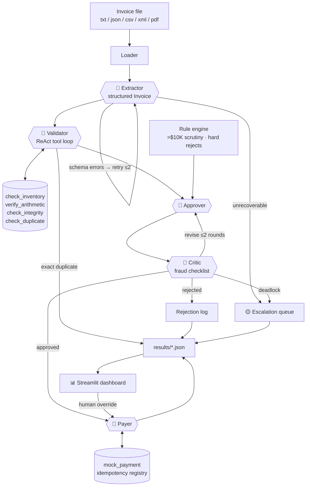

# InvoiceFlow — Multi-Agent Invoice Processing

A working prototype that automates Acme Corp's end-to-end invoice workflow —
**ingestion → validation → approval → payment** — replacing a manual process
with a 30% error rate and 5-day turnaround. Five LLM agents, orchestrated with
**LangGraph** (LangChain's multi-agent layer) and reasoning with **xAI Grok**,
process messy real-world invoices: typos, OCR artifacts, fraud attempts,
duplicate submissions, and data that simply doesn't add up.

*(Original case brief: [docs/CASE.md](docs/CASE.md).)*

## Quickstart

```bash
uv sync                                                    # install (Python 3.12)
uv run python main.py --init-db                            # create + seed inventory.db
uv run python main.py --invoice_path=data/invoices/invoice_1001.txt
uv run python main.py --all                                # batch: all 20 sample files
uv run streamlit run ui/app.py                             # review dashboard
```

Works out of the box with **no API key**: without `XAI_API_KEY` the pipeline
runs on a deterministic offline brain (`stub`) that exercises the exact same
agent code paths. To use real Grok reasoning:

```bash
cp .env.example .env       # put your XAI_API_KEY in it   (or: export XAI_API_KEY=...)
uv run python main.py --all --llm grok
```

## The multi-agent system

Five separately-prompted agents share a LangGraph `StateGraph`. Control is
routed by conditional edges over each agent's **structured output** — agents
never call each other directly, so every hop is inspectable and testable.



| Agent | Role | Agentic pattern |
|---|---|---|
| **Extractor** | Messy text → structured `Invoice` (canonical item names, OCR fixes) | Self-correction loop #1: schema/sanity errors fed back, ≤2 retries |
| **Validator** | Interrogates the invoice against inventory & records | ReAct tool-calling loop over 4 deterministic tools |
| **Approver** | Drafts approve / reject / needs-review with business rationale | Proposer in a reflection pair |
| **Critic** | Adversarial audit against a fraud & scrutiny checklist | Self-correction loop #2: can force revisions or escalate to a human |
| **Payer** | Executes the mock payment or logs the rejection | Guarded tool execution (never pays twice) |

### Design decisions

- **Deterministic where possible, LLM where valuable.** Stock aggregation,
  arithmetic verification, duplicate detection, and hard approval rules are
  plain, unit-tested Python. The LLM does what code can't: extract structure
  from garbage text, reason about fraud signals, and write rationale a
  finance stakeholder can act on.
- **Hard rules outrank both agents.** Even if the Approver *and* Critic wave
  through an invoice with critical failures, the graph overrides them
  (proven by a `RogueApprover` test).
- **Escalation over false confidence.** Ambiguous cases (unknown items,
  foreign currency, revised invoices) become `needs_review` and land in the
  dashboard's escalation queue with one-click human resolution — not a forced
  guess.
- **Idempotency built in.** A processed-invoice registry fingerprints each
  invoice by canonical content, so the same invoice arriving twice — even as
  TXT once and PDF once — is caught as a duplicate and never double-paid.
- **One code path, two brains.** The offline stub is a real
  `BaseChatModel`, so tests and demos execute the same tool loops and
  structured-output calls as production Grok.

## What it catches (the 16 sample invoices)

| Invoice | Landmine | Outcome |
|---|---|---|
| 1001, 1004, 1006, 1015 | clean | ✅ paid |
| 1002 | typos everywhere; 20× GadgetX vs 5 in stock; due = issue date | ⛔ rejected |
| 1003 | zero-stock item, $100K, "due yesterday", urgency pressure | ⛔ rejected |
| 1004-revised | same invoice number, changed content after payment | 🟡 review (paid record preserved) |
| 1005 | aggregate GadgetX order exceeds stock | ⛔ rejected |
| 1007 | stock exceeded on 2 items **and** stated total is $110 short | ⛔ rejected |
| 1008 | items that don't exist; total suspiciously just under $10K | 🟡 review |
| 1009 | no vendor, negative quantity, negative total | ⛔ rejected |
| 1010 | duplicate item lines, tax + shipping arithmetic | ✅ paid |
| 1011/1012 PDFs | PDF extraction; OCR artifacts (`$3,500.O0`, `2O26`) | ✅ paid; resubmitted format = 🔁 duplicate |
| 1013 | 8 line items; quantities only exceed stock *in aggregate* | ⛔ rejected |
| 1014 | XML, EUR currency | 🟡 review |
| 1016 | item missing from inventory | 🟡 review |

## Testing & quality

```bash
uv run pytest                      # 80 offline tests, ~3s, no API key needed
uv run pytest --cov=invoiceflow    # with coverage
uv run pytest -m live              # smoke tests against real Grok (needs XAI_API_KEY)
uv run ruff check && uv run ruff format --check
```

The e2e suite runs every sample file through the full LangGraph pipeline and
asserts the acceptance table above, plus registry-ordering scenarios
(revision-after-payment, cross-format duplicates) and both self-correction
loops (a flaky extractor that recovers, a rogue approver that gets overridden).

## Project layout

```
main.py                  CLI entry point (python main.py --invoice_path=...)
src/invoiceflow/
  graph.py               LangGraph StateGraph wiring + routing
  agents.py              Extractor / Validator / Approver / Critic prompts & loops
  validation.py          deterministic validation tools (the Validator's toolbox)
  rules.py               hard business rules constraining the Approver
  offline.py             deterministic extraction twin (offline/stub brain)
  llm.py                 Grok factory + drop-in offline stub model
  models.py              Pydantic schemas for every agent's structured output
  db.py                  SQLite inventory + processed-invoice registry
  pipeline.py            run wrapper: run IDs, timing, persisted JSON results
  cli.py                 rich terminal UI: per-stage trace, batch summary
ui/app.py                Streamlit dashboard: runs browser + escalation queue
tests/                   82 tests (80 offline + 2 live-marked)
data/invoices/           provided sample invoices (the acceptance dataset)
```

## Business impact

Every invoice is processed in seconds instead of days, with a full audit
trail (per-run JSON: every agent's reasoning, every check, every critique
round). The error modes behind the old 30% rate — mis-keyed data, overlooked
stock mismatches, duplicate payments, fraud pressure tactics — each have a
dedicated, tested defense. Humans stop transcribing and only touch the cases
that genuinely need judgment, delivered to them in a queue with the evidence
already assembled.

### Scope cuts (deliberate)

- Stock is validated against current levels but not decremented on payment —
  reservation semantics belong to the real inventory system.
- Vendor master-data checks (bank details, sanctions lists) are out of scope;
  the `unknown vendor` fraud signal is the hook where they'd attach.
- Email ingestion is simulated by the email-style `.txt` fixture; an IMAP
  poller would slot in front of the loader unchanged.
