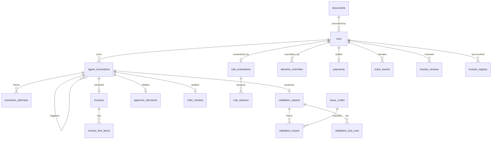

# Data model proposal — `invoiceflow.db`

**Status:** implemented — the DDL lives in `src/invoiceflow/schema.sql`, applied
by `--init-db` and written by `runstore.RunStore`. A drift test
(`tests/test_runstore.py::TestSchema`) keeps this document and that file the
same database; the two deliberate amendments made during implementation are
called out inline below.

Replaces `results/*.json` as the system of record with a normalized SQLite
database the CLI writes and the dashboard reads over SQL joins. Adds the
telemetry (tokens, cost, latency) the old result files had no place for.
`results/*.json` survives as a derived export (`--export-json`), rendered from
the database on demand.

---

## 1. What's wrong with `results/*.json` today

| Problem | Consequence |
|---|---|
| One opaque blob per run | No cross-run question can be answered without loading and re-parsing every file. "What are our top 5 rejection reasons?" is a Python loop, not a query. |
| `RuleConstraints` is never persisted | The graph computes `must_reject` / `must_review` / `requires_scrutiny` and routes on it, then throws it away — `InvoiceRunResult` has no field for it. The *reason* an invoice was forced down a path is missing from the audit trail. |
| The Extractor's self-correction evidence is discarded | `agents.py:83-90` computes the `problems` fed back into each retry prompt and keeps only a retry *count*. The case grades self-correction loops explicitly and we cannot show one working. |
| Human review mutates agent output | `ui/app.py:86` appends the reviewer's note onto `decision.reasoning` and overwrites `final_status` in place. The agent's original decision is destroyed; you cannot later ask "how often do humans overturn the Approver?" |
| No telemetry at all | No tokens, no cost, no per-stage latency. The case is framed as a $2M/year problem and we can't state a cost per invoice. |
| Nothing links runs over the same document | Re-running a file produces an unrelated blob; the UI cannot tell a supersession from a fresh invoice, nor spot a document being reprocessed by accident. |
| Registry lives in a different file | `inventory.db` holds `processed_invoices`; `results/` holds everything else. The dashboard opens both and joins in Python. |

---

## 2. Design decisions

**D1. Two files, joined with `ATTACH`.** `invoiceflow.db` holds everything the
pipeline produces; `inventory.db` stays exactly as it is. The brief tells us to
create the inventory DB as the *legacy system we validate against* — folding it
into our own schema blurs the one boundary the case is explicit about. SQLite's
`ATTACH DATABASE` gives the UI a single connection that can join across both.

**D2. Append-only for everything an agent produced.** A re-run inserts a new
`runs` row; it never updates an old one. Overrides and human reviews are new
rows that *reference* the agent's output instead of editing it. Only
`invoice_registry` and `inventory` are mutable — they model current state, not
history.

**D3. `INTEGER PRIMARY KEY` surrogates, natural keys as `UNIQUE`.** `run_id`
(`invoice_1001-023f0e1b`) stays as the external identifier the CLI, filenames and
LangSmith traces use; joins go through the integer.

**D4. `STRICT` tables + `CHECK` constraints mirroring the `StrEnum`s.** SQLite
3.45 is available. This puts the same guarantee at the DB boundary that
`FinalStatus` gives in Python — a typo'd `'paid'` becomes an error instead of a
silently-never-matching row.

**D5. Issue codes get a reference table, not a 19-value `CHECK`.** `issue_codes`
is seeded from `IssueCode` and carries a `category`, which makes
"failures by category" a `GROUP BY` instead of a hand-maintained mapping.

**D6. Timestamps are ISO-8601 UTC `TEXT`.** Matches what the code already emits
and what `datetime('now')` produces. Sorts correctly as text.

**D7. Agent output is a supertype/subtype pair, not one wide table.**
`agent_invocations` is the spine — one row per agent's turn at a node, uniform
across all four agents. The *payload* stays in typed detail tables, because the
agents genuinely do not share a schema: the Extractor emits an `Invoice`, the
Validator a summary plus advisory issues, the Approver a status plus reasoning,
the Critic a verdict plus feedback. The two alternatives both cost more than
they save — a JSON payload column throws away D4's constraints and turns every
UI query into `json_extract`, and a wide nullable table cannot express
"`verdict` is required if and only if the agent is the Critic". §5's
`v_approval_rounds` pays the extra join back once so the UI never sees it.

**D8. Turn grain for agents, call grain for telemetry — and both stored here.**
`agent_invocations` is one row per agent turn; `llm_calls` is one row per
round-trip inside that turn, FK'd to it. LangSmith is *not* the fallback for
per-call detail: tracing is opt-in and off by default, so a normal run leaves no
trace anywhere but this database. Cost must be answerable from the DB alone.
Rollup columns on the invocation were the alternative and are rejected for the
reason below — aggregating N children onto one parent row is the one-to-many
denormalization that drifts. The views aggregate instead.

**D8a. `run_id` is denormalized onto 1:1 children only.** `invoices` and
`validation_reports` carry both `run_id` and `invocation_id`; `llm_calls` carries
only `invocation_id` and reaches the run through the spine. One row per run
cannot drift; one-to-many denormalization is where it does.

**D9. Child tables for attributed lists, JSON columns for bare ones.**
`rule_reasons` gets a table: each reason carries a `kind`
(reject/review/scrutiny/advisory), and "top rejection reasons" is a headline
query. `risk_factors` gets a JSON column: they are free-text strings with no
attributes, rendered as a bullet list, and the model phrases them differently
every time, so aggregating across rows returns noise rather than insight.
`json_each()` keeps them queryable anyway if that changes.

**D10. Supersession is by document, and it is a flag, not a filter.** Re-running
the same file marks the older run superseded; re-running the same *invoice
number* in a different format does not, because that pair is precisely the
cross-format duplicate case. And superseded runs stay in the base view with
`is_latest = 0` — filtering them out at the bottom would silently drop them from
cost and issue analytics. A re-run is always a real new run, never suppressed:
`documents` is keyed on content alone, so a second run over the same text —
from any path — reuses the document row and shows up as `document_run_no > 1`
and in `v_reprocessed_documents`. Idempotency of *payment* is separate and unchanged —
that is `invoice_registry`'s job.

**D11. No migrations.** The DB is disposable and re-created by `--init-db`;
there is no production data to preserve. One `schema.sql`, applied fresh. The
corollary is that a schema change means `--reset-db`, not a migration: nothing
here has shipped, so every database is free to be a fresh one.

---

## 3. Entity relationships

`agent_invocations` is the hub: every agent-authored fact hangs off the turn
that produced it.



---

## 4. Schema

### 4.1 Intake — the scanned document

```sql
CREATE TABLE documents (
    id              INTEGER PRIMARY KEY,
    -- A document IS its content. Identity deliberately excludes the path, so
    -- the same invoice copied into an inbox/ folder is the same document and
    -- running it again registers as a re-run rather than as new work.
    content_sha256  TEXT    NOT NULL UNIQUE,  -- of raw_text, post-pdfplumber
    raw_text        TEXT    NOT NULL,         -- exactly what the Extractor saw
    file_format     TEXT    NOT NULL CHECK (file_format IN ('txt','json','csv','xml','pdf')),
    char_count      INTEGER NOT NULL,
    first_seen_path TEXT    NOT NULL,         -- where we first found it
    first_seen_at   TEXT    NOT NULL
) STRICT;
```

Storing `raw_text` makes the DB self-contained: the dashboard shows the source
beside the extraction without filesystem access, extraction can be replayed
offline, and a *quarantined* document keeps the text that forged the prompt
fences — the one case where the file at `source_path` is the thing you cannot
trust. The 20 sample invoices total well under 100 KB.

### 4.2 The run

```sql
CREATE TABLE runs (
    id                  INTEGER PRIMARY KEY,
    run_id              TEXT    NOT NULL UNIQUE,        -- 'invoice_1001-023f0e1b'
    -- Amendment: NULLable, where the draft said NOT NULL. A run that fails
    -- before its file can be read (missing file, unsupported format) has no
    -- content to identify a document by — but the failure itself is still
    -- audit-worthy, and "no document, no row" would have silently dropped it.
    document_id         INTEGER REFERENCES documents(id),
    source_path         TEXT    NOT NULL,                -- the path *this* run read
    started_at          TEXT    NOT NULL,
    finished_at         TEXT,
    duration_ms         INTEGER,
    llm_backend         TEXT    NOT NULL DEFAULT '',    -- 'grok-4.6'
    pipeline_revision   TEXT    NOT NULL DEFAULT '',    -- git describe --dirty
    final_status        TEXT    NOT NULL
        CHECK (final_status IN ('paid','rejected','needs_review','duplicate','failed')),
    -- What the system decided, and who actually decided it. Splitting these
    -- two is the fix for overrides silently rewriting the agent's reasoning.
    decision_status     TEXT    CHECK (decision_status IN ('approved','rejected','needs_review')),
    decision_source     TEXT    CHECK (decision_source IN
                              ('agent','hard_rule','critic_escalation','critic_exhausted','human')),
    quarantine_reason   TEXT    NOT NULL DEFAULT '',
    error               TEXT    NOT NULL DEFAULT '',
    langsmith_trace_url TEXT    NOT NULL DEFAULT ''     -- deep link, when tracing was on
) STRICT;
```

Supersession is derived, not stored: the newest run per `document_id` is current
(see `is_latest` in §5). Nothing to keep in sync, and re-running a file never
rewrites history.

Two more implementation notes. `begin_run` inserts this row *before* the graph
runs, as `final_status='failed'` / `error='run did not complete'` — a crash
mid-run leaves an honest audit row instead of nothing, and the registry can FK
`last_run_id` from the start. And because a load failure leaves `document_id`
NULL, `v_run_summary` LEFT JOINs `documents` and pins `is_latest` /
`document_run_no` to 1 for document-less runs (the second declared amendment).

### 4.3 The spine — one row per agent turn

```sql
CREATE TABLE agent_invocations (
    id           INTEGER PRIMARY KEY,
    run_id       INTEGER NOT NULL REFERENCES runs(id) ON DELETE CASCADE,
    seq          INTEGER NOT NULL,              -- order within the run
    node         TEXT    NOT NULL CHECK (node  IN ('ingest','validate','decide','critique')),
    agent        TEXT    NOT NULL CHECK (agent IN ('extractor','validator','approver','critic')),
    round_no     INTEGER NOT NULL DEFAULT 1,    -- reflection round
    -- The reflection loop's causality, as a self-FK rather than a string: the
    -- Critic that said 'revise' is literally what caused the next Approver
    -- draft. NULL means the turn was entered from a graph edge.
    triggered_by INTEGER REFERENCES agent_invocations(id),
    outcome      TEXT    NOT NULL CHECK (outcome IN ('ok','retried','failed')),
    error        TEXT    NOT NULL DEFAULT '',
    started_at   TEXT    NOT NULL,
    duration_ms  INTEGER,                      -- wall clock: model time + tool time
    UNIQUE (run_id, seq)
) STRICT;
```

**The unit is one agent's turn at one node, not one LLM call.** The Validator's
tool loop (two round-trips plus a summary call) is *one* invocation with three
`llm_calls` rows; the Extractor's retries are one invocation with N
`extraction_attempts` and N `llm_calls`. Approver and Critic are separate invocations because they
are separate nodes — which is precisely the fix for the old `approval_rounds`,
where two nodes wrote one row and neither could be recorded alone.

### 4.4 Extraction

```sql
CREATE TABLE invoices (
    id             INTEGER PRIMARY KEY,
    run_id         INTEGER NOT NULL UNIQUE REFERENCES runs(id) ON DELETE CASCADE,
    invocation_id  INTEGER NOT NULL UNIQUE REFERENCES agent_invocations(id) ON DELETE CASCADE,
    invoice_number TEXT    NOT NULL,
    vendor         TEXT    NOT NULL DEFAULT '',
    invoice_date   TEXT,
    due_date       TEXT,
    due_date_raw   TEXT,                       -- 'yesterday' etc. when unparseable
    subtotal       REAL,
    tax_amount     REAL,
    extra_charges  REAL    NOT NULL DEFAULT 0,
    total          REAL,
    currency       TEXT    NOT NULL DEFAULT 'USD',
    payment_terms  TEXT    NOT NULL DEFAULT '',
    notes          TEXT    NOT NULL DEFAULT '',
    content_hash   TEXT    NOT NULL            -- Invoice.content_hash(), cross-format dupes
) STRICT;

CREATE TABLE invoice_line_items (
    id         INTEGER PRIMARY KEY,
    invoice_id INTEGER NOT NULL REFERENCES invoices(id) ON DELETE CASCADE,
    line_no    INTEGER NOT NULL,
    item       TEXT    NOT NULL,
    quantity   INTEGER NOT NULL,               -- negatives kept: they are evidence
    unit_price REAL,
    line_total REAL,
    note       TEXT,
    UNIQUE (invoice_id, line_no)
) STRICT;

-- Self-correction loop #1, currently thrown away. One row per attempt that
-- failed schema or sanity checks, holding the feedback that went into the
-- next prompt. A clean first pass leaves this table empty.
CREATE TABLE extraction_attempts (
    id            INTEGER PRIMARY KEY,
    invocation_id INTEGER NOT NULL REFERENCES agent_invocations(id) ON DELETE CASCADE,
    attempt_no    INTEGER NOT NULL,            -- 1-based
    problems      TEXT    NOT NULL,            -- verbatim, as fed back to the model
    UNIQUE (invocation_id, attempt_no)
) STRICT;
```

One invoice row **per run**, not per invoice number — extraction is a run
artifact and a re-run may legitimately produce different values. Cross-run
identity is `invoice_number` + `content_hash`.

### 4.5 Validation — model insights & warnings

```sql
CREATE TABLE issue_codes (
    code        TEXT PRIMARY KEY,             -- seeded from IssueCode
    category    TEXT NOT NULL CHECK (category IN
                    ('inventory','arithmetic','integrity','duplicate','prompt_safety','agent')),
    description TEXT NOT NULL DEFAULT ''
) STRICT;

CREATE TABLE validation_reports (
    id            INTEGER PRIMARY KEY,
    run_id        INTEGER NOT NULL UNIQUE REFERENCES runs(id) ON DELETE CASCADE,
    invocation_id INTEGER NOT NULL UNIQUE REFERENCES agent_invocations(id) ON DELETE CASCADE,
    summary       TEXT    NOT NULL DEFAULT ''  -- the Validator's prose read
) STRICT;

CREATE TABLE validation_tool_runs (
    id         INTEGER PRIMARY KEY,
    report_id  INTEGER NOT NULL REFERENCES validation_reports(id) ON DELETE CASCADE,
    seq        INTEGER NOT NULL,
    tool_name  TEXT    NOT NULL,
    -- 'agent' = the Validator chose to call it; 'safety_net' = agents.py ran it
    -- because the agent skipped it. Makes "how often does the agent miss a
    -- check?" a query, which is the honest measure of the tool loop's value.
    invoked_by TEXT    NOT NULL CHECK (invoked_by IN ('agent','safety_net')),
    UNIQUE (report_id, tool_name)
) STRICT;

CREATE TABLE validation_issues (
    id        INTEGER PRIMARY KEY,
    report_id INTEGER NOT NULL REFERENCES validation_reports(id) ON DELETE CASCADE,
    seq       INTEGER NOT NULL,
    code      TEXT    NOT NULL REFERENCES issue_codes(code),
    severity  TEXT    NOT NULL CHECK (severity IN ('info','warning','critical')),
    detail    TEXT    NOT NULL,
    -- What the finding is *about*: the item, the currency, the invoice
    -- number. Empty when it is about the vendor's practice as such —
    -- arithmetic drift and dating quirks belong to the vendor, not to any
    -- one value on the page. This is the key precedent is matched on, so a
    -- finding can be compared with history without parsing `detail`'s prose.
    subject   TEXT    NOT NULL DEFAULT '',
    -- 'tool' issues carry authority over routing; 'agent' issues are advisory
    -- (ValidatorSummary demotes them). Today that distinction survives only as
    -- the code 'agent_observation'; here it is a column you can filter on.
    origin    TEXT    NOT NULL CHECK (origin IN ('tool','agent')),
    tool_name TEXT                            -- NULL for agent observations
) STRICT;
```

### 4.6 Rules — why the outcome was forced

```sql
CREATE TABLE rule_evaluations (
    id                 INTEGER PRIMARY KEY,
    run_id             INTEGER NOT NULL UNIQUE REFERENCES runs(id) ON DELETE CASCADE,
    must_reject        INTEGER NOT NULL CHECK (must_reject       IN (0,1)),
    must_review        INTEGER NOT NULL CHECK (must_review       IN (0,1)),
    requires_scrutiny  INTEGER NOT NULL CHECK (requires_scrutiny IN (0,1)),
    -- The policy this run was judged under. Threshold changes are inevitable;
    -- without this, historical decisions become unexplainable.
    scrutiny_threshold REAL    NOT NULL
) STRICT;

-- Normalized per D9: `kind` is a real attribute, and "top rejection reasons"
-- is a headline query for the business write-up.
CREATE TABLE rule_reasons (
    id                 INTEGER PRIMARY KEY,
    rule_evaluation_id INTEGER NOT NULL REFERENCES rule_evaluations(id) ON DELETE CASCADE,
    kind               TEXT    NOT NULL CHECK (kind IN
                           ('reject','review','scrutiny','advisory','precedent')),
    reason             TEXT    NOT NULL
) STRICT;
```

Deterministic, run-level, authored by `rules.py` rather than by an agent — so it
hangs off `runs`, not off the spine. This is the data the current JSON drops
entirely.

### 4.7 Approval — the reflection loop

Two agents, two nodes, two tables, one invocation each. `round_no` on the spine
pairs them; `triggered_by` records which Critic caused which redraft.

```sql
CREATE TABLE approver_decisions (
    id            INTEGER PRIMARY KEY,
    invocation_id INTEGER NOT NULL UNIQUE REFERENCES agent_invocations(id) ON DELETE CASCADE,
    status        TEXT    NOT NULL CHECK (status IN ('approved','rejected','needs_review')),
    reasoning     TEXT    NOT NULL,            -- verbatim; never appended to
    -- JSON per D9: bare strings, no attributes, rendered as a bullet list.
    -- Still queryable via json_each(risk_factors) if that ever changes.
    risk_factors  TEXT    NOT NULL DEFAULT '[]' CHECK (json_valid(risk_factors))
) STRICT;

CREATE TABLE critic_reviews (
    id            INTEGER PRIMARY KEY,
    invocation_id INTEGER NOT NULL UNIQUE REFERENCES agent_invocations(id) ON DELETE CASCADE,
    verdict       TEXT    NOT NULL CHECK (verdict IN ('affirm','revise','escalate')),
    feedback      TEXT    NOT NULL
) STRICT;

-- What the *system* did about what the agents said. Not an agent turn, so it
-- hangs off the run: hard rules and loop exhaustion are deterministic.
CREATE TABLE decision_overrides (
    id            INTEGER PRIMARY KEY,
    run_id        INTEGER NOT NULL REFERENCES runs(id) ON DELETE CASCADE,
    -- The Approver turn whose decision this overrode. round_no is reachable
    -- through it, so it is not stored twice.
    invocation_id INTEGER NOT NULL REFERENCES agent_invocations(id) ON DELETE CASCADE,
    kind        TEXT    NOT NULL CHECK (kind IN
                    ('hard_rule_review','hard_rule_reject','critic_escalation','critic_exhausted')),
    from_status TEXT    NOT NULL,
    to_status   TEXT    NOT NULL,
    reasoning   TEXT    NOT NULL,
    created_at  TEXT    NOT NULL
) STRICT;
```

Three separate facts the current single mutable `reasoning` string conflates:
what the agent said (`approver_decisions`), what the system did about it
(`decision_overrides`), and the effective answer (`runs.decision_status`).

### 4.8 Payment

```sql
CREATE TABLE payments (
    id        INTEGER PRIMARY KEY,
    run_id    INTEGER NOT NULL UNIQUE REFERENCES runs(id) ON DELETE CASCADE,
    status    TEXT    NOT NULL CHECK (status IN ('success','skipped_already_paid')),
    vendor    TEXT    NOT NULL,
    amount    REAL    NOT NULL,
    currency  TEXT    NOT NULL DEFAULT 'USD',
    reference TEXT    NOT NULL DEFAULT '',
    paid_at   TEXT    NOT NULL
) STRICT;
```

### 4.9 Telemetry

```sql
-- One row per round-trip to the model. Lives here, not only in LangSmith:
-- tracing is opt-in and off by default, so this is the only per-call record a
-- normal run leaves behind (D8).
CREATE TABLE llm_calls (
    id                  INTEGER PRIMARY KEY,
    -- No stage and no run_id: the spine already knows which agent ran this
    -- call, at which node, in which round, for which run.
    invocation_id       INTEGER NOT NULL REFERENCES agent_invocations(id) ON DELETE CASCADE,
    seq                 INTEGER NOT NULL,      -- call order within the turn
    model               TEXT    NOT NULL,
    input_tokens        INTEGER NOT NULL DEFAULT 0,
    cached_input_tokens INTEGER NOT NULL DEFAULT 0,
    output_tokens       INTEGER NOT NULL DEFAULT 0,
    reasoning_tokens    INTEGER NOT NULL DEFAULT 0,
    total_tokens        INTEGER NOT NULL DEFAULT 0,
    tool_calls          INTEGER NOT NULL DEFAULT 0,
    latency_ms          INTEGER,               -- model time alone
    cost_usd            REAL,                  -- snapshot under the day's prices
    langsmith_run_id    TEXT,                  -- drill-down when tracing was on
    started_at          TEXT    NOT NULL,
    error               TEXT    NOT NULL DEFAULT '',
    UNIQUE (invocation_id, seq)
) STRICT;

CREATE TABLE model_pricing (
    model                     TEXT NOT NULL,
    effective_from            TEXT NOT NULL,
    input_usd_per_mtok        REAL NOT NULL,
    cached_input_usd_per_mtok REAL,
    output_usd_per_mtok       REAL NOT NULL,
    PRIMARY KEY (model, effective_from)
) STRICT;
```

Cost is stored *and* recomputable: `llm_calls.cost_usd` freezes what each call
actually cost under the prices of the day, `model_pricing` lets you re-price
history when rates change. Keeping `model` per call rather than per turn also
means a future mixed-model run (cheap extractor, strong approver) re-prices
correctly. Token source is `UsageMetadataCallbackHandler`
(already in langchain-core 1.6.0), attached to the `config` dict `pipeline.py:83`
already builds. Comparing `SUM(llm_calls.latency_ms)` against
`agent_invocations.duration_ms` also separates model time from tool time.

### 4.10 Narrative, registry, human review

```sql
CREATE TABLE trace_events (
    id     INTEGER PRIMARY KEY,
    run_id INTEGER NOT NULL REFERENCES runs(id) ON DELETE CASCADE,
    seq    INTEGER NOT NULL,
    stage  TEXT    NOT NULL,
    event  TEXT    NOT NULL,
    detail TEXT    NOT NULL DEFAULT '',
    at     TEXT    NOT NULL,                  -- gives per-stage timings
    UNIQUE (run_id, seq)
) STRICT;

-- The one mutable state table: current status per invoice number.
-- Replaces processed_invoices; same semantics, now FK'd to the run.
CREATE TABLE invoice_registry (
    invoice_number TEXT PRIMARY KEY,
    content_hash   TEXT    NOT NULL,
    vendor         TEXT    NOT NULL DEFAULT '',
    total          REAL,
    final_status   TEXT    NOT NULL
        CHECK (final_status IN ('paid','rejected','needs_review','duplicate','failed')),
    last_run_id    INTEGER REFERENCES runs(id),
    processed_at   TEXT    NOT NULL
) STRICT;

-- Many reviews per run: a run can be confirmed, reopened and overturned, and
-- each of those is a fact worth keeping. "Unchecked" is the absence of any row.
CREATE TABLE human_reviews (
    id          INTEGER PRIMARY KEY,
    run_id      INTEGER NOT NULL REFERENCES runs(id) ON DELETE CASCADE,
    reviewed_at TEXT    NOT NULL,
    reviewer    TEXT    NOT NULL DEFAULT 'dashboard',
    action      TEXT    NOT NULL CHECK (action IN
                    ('confirm','override_approve','override_reject')),
    from_status TEXT    NOT NULL,
    to_status   TEXT    NOT NULL,
    note        TEXT    NOT NULL DEFAULT ''
) STRICT;

-- Which past human decisions authorized this run's automatic one. Written for
-- every finding precedent was consulted on, released or not: a refusal to
-- release is as much a fact about the policy as a release is.
--
-- `terms` holds the burden/support breakdown rather than only the two totals.
-- That is deliberate and forward-looking: with the outcome in `human_reviews`,
-- these rows are a labelled training set for the day the hand-set weights are
-- replaced by a fitted model (docs/beyond-the-brief.md §19, "Day 2").
CREATE TABLE precedent_citations (
    id            INTEGER PRIMARY KEY,
    run_id        INTEGER NOT NULL REFERENCES runs(id) ON DELETE CASCADE,
    code          TEXT    NOT NULL REFERENCES issue_codes(code),
    -- The question, exactly as validation_issues stated it.
    subject       TEXT    NOT NULL DEFAULT '',
    vendor        TEXT    NOT NULL DEFAULT '',
    cases         INTEGER NOT NULL DEFAULT 0,   -- prior human approvals on this key
    rejections    INTEGER NOT NULL DEFAULT 0,   -- any at all zeroes the support
    burden        REAL    NOT NULL,             -- what had to be proven
    support       REAL    NOT NULL,             -- what history supplied
    released      INTEGER NOT NULL CHECK (released IN (0,1)),
    -- Set when something barred release outright, whatever the arithmetic said
    -- (over the scrutiny threshold, a forged prompt fence, a non-releasable code).
    blocked_by    TEXT    NOT NULL DEFAULT '',
    cited_run_ids TEXT    NOT NULL DEFAULT '[]' CHECK (json_valid(cited_run_ids)),
    terms         TEXT    NOT NULL DEFAULT '{}' CHECK (json_valid(terms)),
    UNIQUE (run_id, code, subject)
) STRICT;
```

`human_reviews` was write-only for its whole life: the dashboard filled it in and
nothing ever read it back. `precedent_citations` is the other end of that loop.
When a finding is one a vendor's habits can answer — they really do bill in EUR,
their totals really do drift by pennies — `precedent.py` asks what people decided
about the same question before, prices what is at risk, and the rule engine
either stops insisting on another human or does not.

Three details are load-bearing:

* **`subject` on `validation_issues` is what makes the question addressable.**
  A finding that cannot say what it is *about* can only be matched by parsing
  the prose in `detail`, which is guesswork on the money path. It is empty for
  findings that are about the vendor's practice rather than a value on the page.
* **The row is written whether or not anything was released.** A refusal is as
  much a fact about the policy as a release, and "how often does history fall
  short, and by how much?" is the question that says whether the feature earns
  its complexity.
* **`terms` holds the breakdown, not just `burden` and `support`.** The weights
  are hand-set today. With the outcome sitting in `human_reviews`, these rows are
  a labelled dataset for the day they are fitted instead
  ([beyond-the-brief.md](beyond-the-brief.md) §19, "Day 2").

### 4.11 The upload inbox

The dashboard accepts uploads, so intake now has a state that predates any run.
This is deliberately *not* derived from `runs`:

* A queued file has no `runs` row at all. `begin_run` is called by the pipeline
  once it starts, so everything between "uploaded" and "started" would be
  invisible — which is exactly the window the inbox exists to show.
* `runs.source_path` is where we stored the bytes. The name the person uploaded
  is what they will scan the list for, and only this table keeps it.
* An upload can fail before it is a run at all (unreadable PDF, unsupported
  extension, no API key). That failure belongs to the file, not to a run that
  never began.

Note the asymmetry in `state`: **`processed` means a run happened and reached a
verdict, not that the verdict was good.** A run that ended `failed` is a
processed item — the pipeline did its job and gave an honest answer. `failed`
here means we never got a run out of the file at all.

`state` is mutable, like `invoice_registry` and unlike everything an agent
produced (D2): it models where a file *is*, not what happened to it. What
happened to it is the `runs` row this points at.

```sql
CREATE TABLE inbox_items (
    id             INTEGER PRIMARY KEY,
    filename       TEXT    NOT NULL,          -- exactly what the browser sent
    -- Unique by construction: every upload gets its own directory, so the
    -- vendor's filename survives collisions intact and still reads well inside
    -- run_id, which pipeline.py builds from the path stem.
    stored_path    TEXT    NOT NULL UNIQUE,
    file_format    TEXT    NOT NULL CHECK (file_format IN ('txt','json','csv','xml','pdf')),
    byte_size      INTEGER NOT NULL,
    -- Of the loaded TEXT, not of the bytes: that is what documents.content_sha256
    -- keys on, so the same invoice re-exported as a fresh PDF is still recognised
    -- as the same document. Not a foreign key — the documents row is written by
    -- the ingest node, which has not run yet when this row is created.
    content_sha256 TEXT    NOT NULL,
    -- How many runs this exact content already had when it was uploaded. >0 is
    -- what the upload dialog warns about, before six Grok calls are spent.
    prior_runs     INTEGER NOT NULL DEFAULT 0,
    source         TEXT    NOT NULL DEFAULT 'upload'
        CHECK (source IN ('upload','samples')),
    -- 'processed' means a run happened and reached a verdict — NOT that the
    -- verdict was good. A run that ended `failed` is a processed item with an
    -- honest answer, which is a different fact from an item we never managed to
    -- start at all. That one is 'failed' here.
    state          TEXT    NOT NULL DEFAULT 'queued'
        CHECK (state IN ('queued','processing','processed','failed')),
    stage          TEXT    NOT NULL DEFAULT '',  -- live graph node while processing
    run_id         INTEGER REFERENCES runs(id),
    error          TEXT    NOT NULL DEFAULT '',
    enqueued_at    TEXT    NOT NULL,
    started_at     TEXT,
    finished_at    TEXT,
    dismissed_at   TEXT                        -- cleared from the list, never deleted
) STRICT;
```

A worker claims the head of the queue with one atomic statement, so the claim
can never be issued twice — the guarantee should not depend on there happening
to be a single worker:

    UPDATE inbox_items SET state = 'processing', started_at = ?, stage = ''
    WHERE id = (SELECT id FROM inbox_items WHERE state = 'queued' ORDER BY id LIMIT 1)
    RETURNING *

`SELECT`-then-`UPDATE` would be wrong here for a subtle reason: that is a
deferred transaction upgrading read→write, and SQLite does *not* invoke the
busy handler for a snapshot-upgrade conflict, so `busy_timeout` would not cover
it. One statement sidesteps the problem entirely.

---

## 5. Views the UI reads

`v_approval_rounds` is the one that pays back D7: normalized storage,
denormalized read, returning exactly the row shape the old single-table design
would have.

```sql
CREATE VIEW v_approval_rounds AS
SELECT ai.run_id, ai.round_no,
       d.status       AS decision_status,
       d.reasoning    AS decision_reasoning,
       d.risk_factors AS risk_factors_json,
       c.verdict      AS critic_verdict,
       c.feedback     AS critic_feedback,
       ai.started_at
FROM agent_invocations ai
JOIN      approver_decisions d  ON d.invocation_id = ai.id
LEFT JOIN agent_invocations  ci ON ci.triggered_by = ai.id AND ci.agent = 'critic'
LEFT JOIN critic_reviews     c  ON c.invocation_id = ci.id
WHERE ai.agent = 'approver';

CREATE VIEW v_run_summary AS
SELECT r.run_id, r.started_at, r.duration_ms, r.final_status,
       r.decision_status, r.decision_source,
       r.source_path, d.file_format,
       i.invoice_number, i.vendor, i.total, i.currency,
       -- D10: superseded runs stay visible and stay in the analytics.
       -- Document-less runs (load failures) count as their own latest.
       CASE WHEN r.document_id IS NULL THEN 1 ELSE
         (r.id = (SELECT MAX(r2.id) FROM runs r2 WHERE r2.document_id = r.document_id))
       END AS is_latest,
       -- >1 means this document has been through the pipeline before.
       CASE WHEN r.document_id IS NULL THEN 1 ELSE
         (SELECT COUNT(*) FROM runs r3
          WHERE r3.document_id = r.document_id AND r3.id <= r.id)
       END AS document_run_no,
       COALESCE(iss.issue_count, 0)        AS issue_count,
       COALESCE(iss.critical_count, 0)     AS critical_count,
       COALESCE(tel.calls, 0)              AS llm_calls,
       COALESCE(tel.total_tokens, 0)       AS total_tokens,
       ROUND(COALESCE(tel.cost_usd, 0), 4) AS cost_usd,
       hr.last_reviewed_at                 AS human_reviewed_at
FROM runs r
LEFT JOIN documents d ON d.id = r.document_id
LEFT JOIN invoices  i ON i.run_id = r.id
-- Pre-aggregated, not joined directly: issues and calls are both one-to-many
-- off the run, and joining them side by side would multiply the cost sum by
-- the issue count.
LEFT JOIN (
    SELECT vr.run_id,
           COUNT(*)                      AS issue_count,
           SUM(vi.severity = 'critical') AS critical_count
    FROM validation_reports vr
    JOIN validation_issues  vi ON vi.report_id = vr.id
    GROUP BY vr.run_id
) iss ON iss.run_id = r.id
LEFT JOIN (
    SELECT ai.run_id, COUNT(*) AS calls,
           SUM(lc.total_tokens) AS total_tokens, SUM(lc.cost_usd) AS cost_usd
    FROM llm_calls lc
    JOIN agent_invocations ai ON ai.id = lc.invocation_id
    GROUP BY ai.run_id
) tel ON tel.run_id = r.id
LEFT JOIN (
    SELECT run_id, MAX(reviewed_at) AS last_reviewed_at
    FROM human_reviews GROUP BY run_id
) hr ON hr.run_id = r.id;

-- What the dashboard shows by default.
CREATE VIEW v_current_runs AS
SELECT * FROM v_run_summary WHERE is_latest = 1;

-- The escalation queue, biggest exposure first.
CREATE VIEW v_review_queue AS
SELECT * FROM v_current_runs
WHERE final_status = 'needs_review' AND human_reviewed_at IS NULL
ORDER BY total DESC;

-- Every finding a *person* settled, and how. The single definition of "history
-- has an answer to this question", read by precedent.py.
--
-- Note what the inner joins do rather than a WHERE clause: a run with no
-- human_reviews row simply is not here. That is the compounding guard expressed
-- as shape — an automatically approved invoice can never become the evidence
-- for the next automatic approval, because it has nothing to join to.
CREATE VIEW v_review_precedent AS
SELECT vi.code, vi.subject, i.vendor,
       r.run_id, i.invoice_number, i.total, i.currency, vi.detail,
       hr.action, hr.to_status, hr.reviewed_at, hr.note
FROM validation_issues  vi
JOIN validation_reports vr ON vr.id = vi.report_id
JOIN runs               r  ON r.id  = vr.run_id
JOIN invoices           i  ON i.run_id = r.id
-- The latest review only: a run can be confirmed, reopened and overturned, and
-- only where it finally landed is what the person actually decided.
JOIN human_reviews      hr ON hr.id =
     (SELECT MAX(h.id) FROM human_reviews h WHERE h.run_id = r.id)
-- Tool-authored findings only. ValidatorSummary already demotes agent-authored
-- issues and clears their subject; this is the second lock on a key no model
-- may mint for itself.
WHERE vi.origin = 'tool';

-- What the pipeline has learned, per open question. Drives the Learning tab and
-- answers "which reviews is the system now acting on by itself?" in one query.
CREATE VIEW v_precedent_learning AS
SELECT code, subject, vendor,
       SUM(to_status = 'paid')     AS approvals,
       SUM(to_status = 'rejected') AS rejections,
       COUNT(*)                    AS decisions,
       MAX(reviewed_at)            AS last_reviewed_at,
       -- The largest sum a person has signed off on this key. Precedent never
       -- reaches past it by much, so it reads as the standing's ceiling.
       MAX(CASE WHEN to_status = 'paid' THEN total END) AS largest_approved,
       GROUP_CONCAT(invoice_number, ', ') AS invoices
FROM v_review_precedent
GROUP BY code, subject, vendor
ORDER BY approvals DESC;

-- What the Inbox tab reads: every upload with the outcome of the run it
-- produced folded in. LEFT JOINs throughout — an item that has not run yet is
-- the normal case, not a missing row. Dismissed rows drop out here and stay in
-- the table.
CREATE VIEW v_inbox AS
SELECT ib.id, ib.filename, ib.file_format, ib.byte_size, ib.source, ib.state,
       ib.stage, ib.error, ib.prior_runs, ib.enqueued_at, ib.started_at, ib.finished_at,
       r.run_id, s.final_status, s.invoice_number, s.vendor, s.total, s.currency,
       s.duration_ms, s.cost_usd, s.issue_count, s.document_run_no
FROM inbox_items ib
LEFT JOIN runs          r ON r.id = ib.run_id
LEFT JOIN v_run_summary s ON s.run_id = r.run_id
WHERE ib.dismissed_at IS NULL;

-- Business impact: what actually goes wrong, most common first.
CREATE VIEW v_issue_frequency AS
SELECT ic.category, vi.code, vi.severity, vi.origin, COUNT(*) AS occurrences
FROM validation_issues vi
JOIN issue_codes ic ON ic.code = vi.code
GROUP BY ic.category, vi.code, vi.severity, vi.origin
ORDER BY occurrences DESC;

-- Where the money goes. Turn stats and call stats are aggregated separately
-- and then joined: counting turns across the call fan-out would inflate both
-- the turn count and the average duration.
CREATE VIEW v_cost_by_agent AS
SELECT t.agent, t.turns, t.avg_duration_ms,
       COALESCE(c.calls, 0)              AS calls,
       COALESCE(c.tokens, 0)             AS tokens,
       ROUND(COALESCE(c.cost_usd, 0), 4) AS cost_usd
FROM (
    SELECT agent, COUNT(*) AS turns, ROUND(AVG(duration_ms)) AS avg_duration_ms
    FROM agent_invocations GROUP BY agent
) t
LEFT JOIN (
    SELECT ai.agent, COUNT(*) AS calls,
           SUM(lc.total_tokens) AS tokens, SUM(lc.cost_usd) AS cost_usd
    FROM llm_calls lc
    JOIN agent_invocations ai ON ai.id = lc.invocation_id
    GROUP BY ai.agent
) c ON c.agent = t.agent
ORDER BY cost_usd DESC;

-- Accidental reprocessing: the same file, run more than once.
CREATE VIEW v_reprocessed_documents AS
SELECT d.first_seen_path, COUNT(r.id) AS run_count,
       COUNT(DISTINCT r.source_path)          AS distinct_paths,
       MIN(r.started_at) AS first_run_at, MAX(r.started_at) AS last_run_at,
       GROUP_CONCAT(r.final_status, ' -> ')   AS statuses
FROM documents d
JOIN runs r ON r.document_id = d.id
GROUP BY d.id
HAVING COUNT(r.id) > 1;

-- Both self-correction loops, in one place, for the write-up.
CREATE VIEW v_self_correction AS
SELECT r.run_id,
       COALESCE(ex.retries, 0)  AS extraction_retries,
       COALESCE(rev.redrafts,0) AS approver_redrafts
FROM runs r
LEFT JOIN (
    SELECT ai.run_id, COUNT(*) AS retries
    FROM extraction_attempts ea
    JOIN agent_invocations ai ON ai.id = ea.invocation_id
    GROUP BY ai.run_id
) ex ON ex.run_id = r.id
LEFT JOIN (
    SELECT run_id, COUNT(*) AS redrafts
    FROM agent_invocations
    WHERE agent = 'approver' AND triggered_by IS NOT NULL
    GROUP BY run_id
) rev ON rev.run_id = r.id;
```

`v_review_precedent` is worth reading twice, because the important thing about it
is a join rather than a filter. A run reaches it only through `human_reviews`, so
an invoice the pipeline approved by itself is not in the view at all — it has
nothing to join to. That is the guard the whole feature rests on, and expressing
it as shape rather than as `WHERE decided_by = 'human'` means no future query can
forget it: without it, one approval votes for the next decision, that one votes
for the next, and the system ends up citing itself as the reason it paid.

The second join is the same kind of care at smaller stakes: `hr.id = (SELECT
MAX(...))` takes only the *latest* review per run. A run can be confirmed,
reopened and overturned, and only where it finally landed is what the person
actually decided.

---

## 6. Indexes

Only what `UNIQUE` does not already cover — `agent_invocations(run_id, seq)`,
`llm_calls(invocation_id, seq)` and `trace_events(run_id, seq)` are indexed by
their unique constraints, so they are absent here on purpose.

```sql
CREATE INDEX idx_runs_document        ON runs(document_id);
CREATE INDEX idx_runs_status_started  ON runs(final_status, started_at DESC);
CREATE INDEX idx_invocations_trigger  ON agent_invocations(triggered_by);
CREATE INDEX idx_invocations_agent    ON agent_invocations(agent, round_no);
CREATE INDEX idx_invoices_number      ON invoices(invoice_number);
CREATE INDEX idx_invoices_hash        ON invoices(content_hash);
CREATE INDEX idx_issues_report        ON validation_issues(report_id);
CREATE INDEX idx_issues_code          ON validation_issues(code, severity);
-- The precedent lookup's driving predicate: one question, across all history.
CREATE INDEX idx_issues_subject       ON validation_issues(code, subject);
CREATE INDEX idx_overrides_run        ON decision_overrides(run_id);
CREATE INDEX idx_overrides_invocation ON decision_overrides(invocation_id);
CREATE INDEX idx_human_reviews_run    ON human_reviews(run_id);
CREATE INDEX idx_inbox_state          ON inbox_items(state, id);
```

## 7. Connection setup

```sql
PRAGMA journal_mode = WAL;    -- once, persistent: Streamlit reads while the CLI writes
PRAGMA foreign_keys = ON;     -- PER CONNECTION — off by default, easy to forget
PRAGMA busy_timeout = 5000;
PRAGMA synchronous = NORMAL;
```

`foreign_keys` being per-connection and default-off is the classic SQLite trap:
every `REFERENCES` above is inert unless `Database.connect()` sets it, and the
self-FK on `agent_invocations` is exactly the kind of thing that rots silently
without it.

---

## 8. Rollout

No migrations (D11): `--init-db` applies `schema.sql` to a fresh file, and
`--reset-db` drops and recreates it.

| Phase | Work | Ships |
|---|---|---|
| 1 | `schema.sql`, `Database` repository methods, round-trip tests | DB exists, nothing uses it |
| 2 | `Pipeline._persist` writes a run in one transaction; JSON export kept in parallel | Both paths agree — the safety net for phase 4 |
| 3 | Agents record invocations; Extractor's failed attempts captured | Self-correction becomes visible |
| 4 | `UsageMetadataCallbackHandler` → invocation telemetry; cost in the CLI summary | Cost per invoice |
| 5 | Dashboard reads views; human review writes `human_reviews` | Single source of truth |
| 6 | `--export-json <run_id>` renders a run *from* the DB; `_persist` stops writing JSON | One writer, single-run traceability kept |
| 7 | Load-time notice when `document_run_no > 1` — non-blocking, never a prompt | Accidental reprocessing is visible without breaking `--all` or scripting |
| 8 | `inbox_items` + `v_inbox`; the dashboard uploads, queues and drains in the background | Intake stops being CLI-only |

Phase 6 is the answer to "keep the JSON files?": keep the artifact, drop the
second writer. A file rendered from the DB on demand cannot drift from it, which
a parallel writer eventually will. The e2e suite asserts on the JSON today, so it
keeps passing through phases 1–5 and then switches to the exporter.

---

## 9. Open questions

1. Anything else for the write-up — per-session batch stats, wall-clock for
   `--all`?

*Resolved:* `raw_text` stays (quarantine evidence). Re-runs create real runs and
are surfaced by `document_run_no` / `v_reprocessed_documents`; payment
idempotency remains `invoice_registry`'s job. `decision_overrides` FKs to the
invocation it overrode. Document identity is content-only. The re-run notice is
a non-blocking CLI line (phase 7), not a confirmation prompt — a prompt would
break `--all` and scripted use, and the harm it would prevent is already
prevented by `check_duplicate`.

*Parked, pipeline not schema:* once document identity is reliable, an exact
re-run could short-circuit before extraction and save all ~6 Grok calls.
